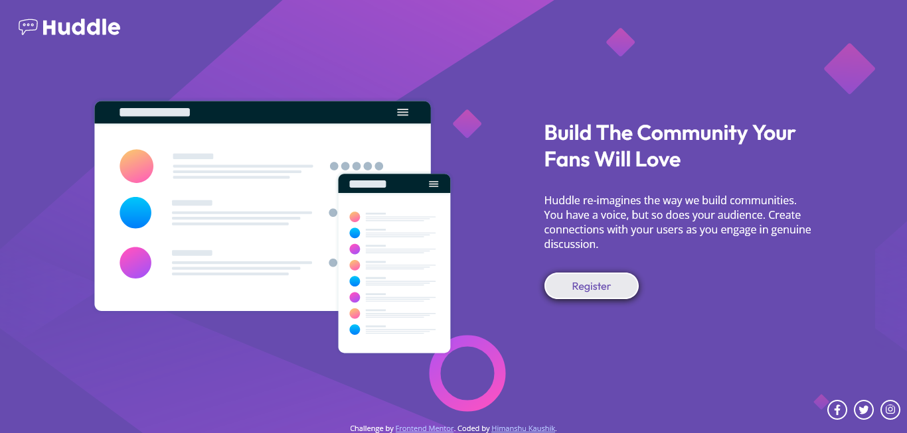

# Frontend Mentor - Huddle landing page with single introductory section solution

This is a solution to the [Huddle landing page with single introductory section challenge on Frontend Mentor](https://www.frontendmentor.io/challenges/huddle-landing-page-with-a-single-introductory-section-B_2Wvxgi0). Frontend Mentor challenges help you improve your coding skills by building realistic projects.

## Table of contents

- [Overview](#overview)
  - [The challenge](#the-challenge)
  - [Screenshot](#screenshot)
  - [Links](#links)
- [My process](#my-process)
  - [Built with](#built-with)
  - [What I learned](#what-i-learned)
  - [Continued development](#continued-development)
  - [Useful resources](#useful-resources)
- [Author](#author)

## Overview

### The challenge

Users should be able to:

- View the optimal layout for the page depending on their device's screen size
- See hover states for all interactive elements on the page

### Screenshot

### Links

- Solution URL: [Github repository](https://github.com/HectorKayman/huddle-landing-page)
- Live Site URL: [Github Pages](https://hectorkayman.github.io/huddle-landing-page/)

## My process

I created a landing page for the "Huddle" website using HTML and CSS. Here's an overview of my process and what I learned during the project:

### Built with

- **HTML**: I started by structuring the webpage using HTML. I defined the document structure, added metadata, and created the main layout.

- **CSS**: I styled the webpage using CSS to achieve the desired visual design. This involved setting up fonts, colors, layout, and responsive design for various screen sizes.

### What I learned

During the project, I learned several key concepts and techniques:

- **Responsive Design**: I gained a better understanding of responsive web design by using media queries to adjust the layout and styling based on the screen size. This ensures that the webpage looks good on both desktop and mobile devices.

- **CSS Flexbox**: I used CSS flexbox to create a flexible and responsive layout for the main content section. It allowed me to easily align and distribute content within the columns.

- **CSS Transitions**: I implemented smooth transitions for button hover effects and social media icons. This adds interactivity and enhances the user experience.

- **Font Usage**: I integrated Google Fonts into the project, which allowed me to use custom fonts for the text. I also learned how to apply different fonts to specific elements.

### Continued development

In the future, I plan to further enhance this project by:

- **Improving Accessibility**: Accessibility is crucial for a website, and I aim to make this project more accessible by implementing proper ARIA roles and labels.

- **Optimizing Performance**: To ensure a faster loading time, I will optimize images and resources and explore techniques like lazy loading for images.

- **Cross-Browser Compatibility**: I will test the website on various web browsers to ensure it works well on all major platforms.

This project was a great learning experience, and I look forward to applying these skills to more complex web development projects in the future.

### Useful resources

- [Learn Flexbox the easy way](https://www.youtube.com/watch?v=u044iM9xsWU) - by Kevin Powell.
- [The horrors of margin](https://youtu.be/KVQMoEFUee8?si=xeYlAjlbPZtxQB7b) - by Theo t3.gg.

## Author

- Frontend Mentor - [@HectorKayman](https://www.frontendmentor.io/profile/HectorKayman)
